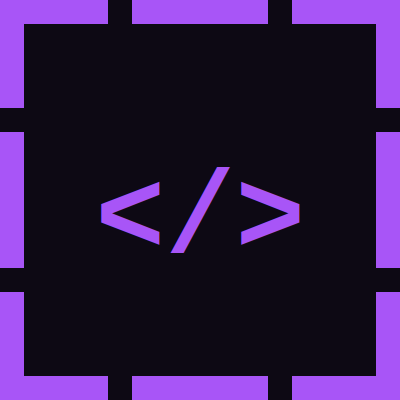

# LOLWeb

<a href="https://github.com/L0Lweb/LOLWeb.github.io"></a>

**LOLWeb** is a curated reference of web application platforms and their attack vectors for achieving Remote Code Execution, reverse shells, and persistent access.

It documents how legitimate features of widely deployed web applications — CMS platforms, CI/CD servers, application frameworks, and admin panels — can be abused to execute OS commands, establish reverse shells, deploy persistent web shells, and read or write server-side files. Each entry maps attack vectors to the required access level and the resulting capability.

Inspired by [GTFOBins](https://gtfobins.github.io/) and [LOLBAS](https://lolbas-project.github.io/).

> This project is intended for authorized penetration testers, red teamers, and security researchers. Always obtain proper authorization before testing.

## Entries

Drupal · GitLab · Grafana · Jenkins · Joomla · Jupyter Notebook · phpMyAdmin · Spring Boot Actuator · Tomcat · WordPress

## Features

- **Functions**: RCE, reverse shell, bind shell, webshell, file read, file write, SSRF
- **Contexts**: unauthenticated, authenticated, admin, console, CI/CD, API token, plugin
- **LHOST/LPORT Templating**: enter your attacker IP and port once, all payloads update automatically
- **Platform Toggle**: switch between Linux and Windows payload variants
- **Search & Filter**: filter by function, context, or technology name

## Local Development

```
make serve
```

Starts a Docker container that builds the site and serves it at <http://0.0.0.0:4000>. File changes are applied automatically (except `_config.yml`, which requires a restart).

```
make vet
```

Validates schema and formatting of all YAML entries. Run `make format` to auto-fix formatting.

## Contributing

See [CONTRIBUTING.md](CONTRIBUTING.md).
